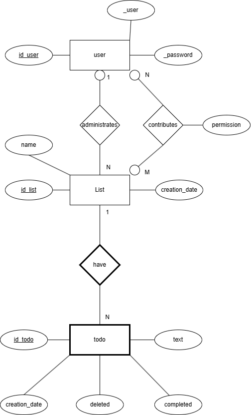
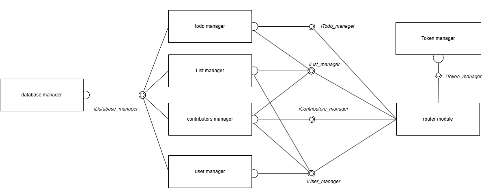
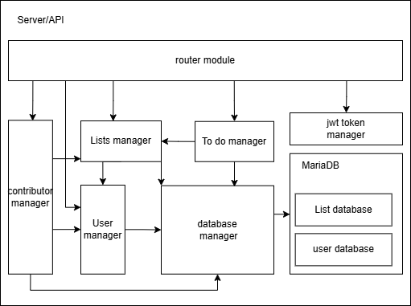

## Introduction:
This project was born out of the idea to have something as a presentation card about who I am and what I am capable of doing. It is a small and concise project to implement a "to-do" system, where we can create and delete lists containing these "to-dos" and add contributors to assist in the task.

## Tech stack
- Express: To create the REST API
- BCrypt: To hash, store, and compare passwords
- jsonwebtoken: To manage JWTs
- dotenv: To handle environment variables

## How to run the proyect

Requirements: Docker (for full deployment) or Node.js v20 or higher (for partial deployment)

1. Full Deployment  
    0. Clone the repository using `https://github.com/BrunoTrinitario/Api-server-task-manager`

        Configuration
        Navigate to the project directory to find the two configuration files `./docker-compose.yml` and `./API/.env`. For `docker-compose.yml`, it contains the directives for Docker to run the project. The following configurations can be adjusted as needed:   
            
            mariadb:
            ...
            environment:
            MARIADB_ALLOW_EMPTY_ROOT_PASSWORD: 'yes'
            MARIADB_USER: 'root'
            MARIADB_PASSWORD: ''
            ports:
            - "3306:3306"
            ...

            backend:
            ...
            ports:
            - "3000:3000"
            ...
        In the `environment` section, you can specify the user and password for the database creation. More information can be found at MariaDB on Docker Hub. In the `ports` section, set the mapping for database and API connections as [host_port]:[docker_port]. It is recommended to use symmetric mapping.
        For `.env`, it contains the environment variables used by the API.

            PORT = [port to connect to the API (matches the host port set in Docker)]

            IP_DB = [IP address to connect to the database]

            PORT_DB = [port to connect to the database (matches the host port set in Docker)]

            USER_DB = [database user (specified in Docker)] 

            PASS_DB = [database password (specified in Docker)]

            DB_NAME = 'listas' [name of the database to connect to]

            SECRET = [secret key to sign JWT tokens]
   
    1. Run the project executing the following command from the project root directory `docker compose up`

2. Partial Deployment
- This involves running the API on the host machine with an existing MariaDB database installed.
- Configure the database using the script found in ./database/init.sql to create the required database structure.
- Once the .env file in ./API is configured with appropriate ports, users, passwords, and IP addresses, proceed as follows:
    1. Navigate to `./API` via the terminal 
    2. Install dependencies: `node install`
    3. Run the API: `node server.js`

## API endpoints
### PATH: `./login`

| Method | Type      | Parameters                          | Response                                                                                       |
|--------|-----------|-------------------------------------|------------------------------------------------------------------------------------------------|
| **GET**  | Header    | `authorization: username:password` | **200:** OK **400:** Malformed header **401:** Incorrect password **404:** User not found **500:** Database error |
|        |  Response      |  `{`  `"id_user": [user_id],` `"acc_token": [jwt_access_token],` `"ref_tok": [jwt_refresh_token]` `}` |                                                                 |
| **POST** | Body      | `{ "username": [username], "password": [password] }` | **200:** OK **400:** Invalid registration data **409:** User already exists **500:** Database error |
| **PATCH**| Body      | `{ "username": [username], "password": [current_password], "newpassword": [new_password] }` | **200:** OK **400:** Invalid data or credentials **404:** User not found **500:** Database error |
| **DELETE**| Body      | `{ "username": [username], "password": [current_password] }` | **200:** OK **400:** Invalid data or credentials **404:** User not found **500:** Database error |

### PATH: `./refresh`

| Method | Type   | Parameters                          | Response                                                                                       |
|--------|--------|-------------------------------------|------------------------------------------------------------------------------------------------|
| **GET**  | Header | `authorization: bearer [refresh_token]` | **200:** OK **400:** Malformed header **401:** JWT error **403:** Token verification error |
|        |   Response     |  `{` `"acc_token": [jwt_access_token],` `"ref_tok": [same_jwt_refresh_token]` `}` |    

### PATH: `./list`

##### **GET** `/lists`
| Parameter            | Type   | Description                             |
|----------------------|--------|-----------------------------------------|
| **Header**           | `authorization: bearer [access_token]` | Access token for authentication.        |
| **Response**         | JSON   | List of objects: `[{` `"id_list": [list_id],` `"name": [list_name],` `"id_administrator": [administrator_id],` `"creation_date": [creation_date]` `}, ...]` |

| Code  | Description                      |
|-------|----------------------------------|
| **200**| OK                               |
| **400**| Invalid GET data                 |
| **401**| Invalid JWT token                |
| **403**| Expired JWT token                |
| **500**| Database error                   |

---

##### **POST** `/lists`
| Parameter            | Type   | Description                             |
|----------------------|--------|-----------------------------------------|
| **Header**           | `authorization: bearer [access_token]` | Access token for authentication.        |
| **Body**             | JSON   | `{ "name": [list_name] }`               |

| Code  | Description                      |
|-------|----------------------------------|
| **200**| OK                               |
| **400**| Invalid registration data       |
| **401**| Invalid JWT token               |
| **403**| Expired JWT token               |
| **404**| User not found                  |
| **500**| Database error                  |

---

##### **PATCH** `/lists/:id_list`
| Parameter            | Type   | Description                             |
|----------------------|--------|-----------------------------------------|
| **Header**           | `authorization: bearer [access_token]` | Access token for authentication.        |
| **Body**             | JSON   | `{ "newname": [new_list_name] }`        |

| Code  | Description                      |
|-------|----------------------------------|
| **200**| OK                               |
| **400**| Invalid modification data       |
| **401**| Invalid JWT token               |
| **403**| Expired JWT token               |
| **403**| User lacks permissions          |
| **404**| List not found                  |
| **500**| Database error                  |

---

##### **DELETE** `/lists/:id_list`
| Parameter            | Type   | Description                             |
|----------------------|--------|-----------------------------------------|
| **Header**           | `authorization: bearer [access_token]` | Access token for authentication.        |

| Code  | Description                      |
|-------|----------------------------------|
| **200**| OK                               |
| **400**| Invalid deletion data           |
| **401**| Invalid JWT token               |
| **403**| Expired JWT token               |
| **403**| User lacks permissions          |
| **404**| List not found                  |
| **500**| Database error                  |

### PATH: `./list/:id_list/todo`

##### **GET** `/todos`
| Parameter            | Type   | Description                             |
|----------------------|--------|-----------------------------------------|
| **Header**           | `authorization: bearer [access_token]` | Access token for authentication.        |
| **Response**         | JSON   | List of objects: `[{` `"id_todo": [todo_identifier],` `"id_list": [list_identifier],` `"creation_date": [creation_date],` `"deleted": [was_deleted],` `"_text": [content_text]` `}, ...]` |

| Code  | Description                      |
|-------|----------------------------------|
| **200**| OK                               |
| **400**| Invalid user input               |
| **401**| Invalid JWT token               |
| **403**| Expired JWT token               |
| **403**| User lacks permissions          |
| **404**| List not found                  |
| **500**| Database error                  |

---

##### **POST** `/todos`
| Parameter            | Type   | Description                             |
|----------------------|--------|-----------------------------------------|
| **Header**           | `authorization: bearer [access_token]` | Access token for authentication.        |
| **Body**             | JSON   | `{ "text": [todo_text] }`               |

| Code  | Description                      |
|-------|----------------------------------|
| **200**| OK                               |
| **400**| Invalid registration data       |
| **401**| Invalid JWT token               |
| **403**| Expired JWT token               |
| **403**| User lacks permissions          |
| **404**| List not found                  |
| **500**| Database error                  |

---

##### **PATCH** `/todos/:id_todo`
| Parameter            | Type   | Description                             |
|----------------------|--------|-----------------------------------------|
| **Header**           | `authorization: bearer [access_token]` | Access token for authentication.        |
| **Body**             | JSON   | `{ "newtext": [new_todo_text] }`        |

| Code  | Description                      |
|-------|----------------------------------|
| **200**| OK                               |
| **400**| Invalid modification data       |
| **401**| Invalid JWT token               |
| **403**| Expired JWT token               |
| **403**| User lacks permissions          |
| **404**| List not found                  |
| **404**| Todo not found                  |
| **500**| Database error                  |

---

##### **DELETE** `/todos/:id_todo`
| Parameter            | Type   | Description                             |
|----------------------|--------|-----------------------------------------|
| **Header**           | `authorization: bearer [access_token]` | Access token for authentication.        |
| **Body**             | JSON   | `{ "action": [action_for_todo] }`       |

| Code  | Description                      |
|-------|----------------------------------|
| **200**| OK                               |
| **400**| Invalid deletion data           |
| **401**| Invalid JWT token               |
| **403**| Expired JWT token               |
| **403**| User lacks permissions          |
| **404**| List not found                  |
| **404**| Todo not found                  |
| **405**| Invalid action                  |
| **500**| Database error                  |

### PATH `./list/:id_list/contributors`

##### **GET** `/contributors`
| Parameter            | Type   | Description                             |
|----------------------|--------|-----------------------------------------|
| **Header**           | `authorization: bearer [access_token]` | Access token for authentication.        |
| **Response**         | JSON   | List of objects: `[{` `"id_user": [user_id],` `"_user": [username],` `"permission": [permissions]` `}, ...]` |

| Code  | Description                      |
|-------|----------------------------------|
| **200**| OK                               |
| **401**| Invalid JWT token               |
| **403**| Expired JWT token               |
| **403**| User lacks permissions          |
| **404**| List not found                  |
| **500**| Database error                  |

---

##### **POST** `/contributors/generate-link`
| Parameter            | Type   | Description                             |
|----------------------|--------|-----------------------------------------|
| **Header**           | `authorization: bearer [access_token]` | Access token for authentication.        |
| **Body**             | JSON   | `{ "permission": [permissions] }`       |
| **Response**         | JSON   | `{ "link": "http:/[host:port]/list/:id_list/contributors/:random_number" }` |

| Code  | Description                      |
|-------|----------------------------------|
| **200**| OK                               |
| **400**| Invalid link generation data    |
| **401**| Invalid JWT token               |
| **403**| Expired JWT token               |
| **403**| User lacks permissions          |
| **404**| List not found                  |
| **500**| Database error                  |

---

##### **POST** `/contributors/link`
| Parameter            | Type   | Description                             |
|----------------------|--------|-----------------------------------------|
| **Header**           | `authorization: bearer [access_token]` | Access token for authentication.        |

| Code  | Description                      |
|-------|----------------------------------|
| **200**| OK                               |
| **400**| Invalid user data sent          |
| **401**| Invalid JWT token               |
| **403**| Expired JWT token               |
| **404**| Link not found                  |
| **404**| User not found                  |
| **404**| List not found                  |
| **410**| Link expired                    |
| **500**| Database error                  |

---

##### **DELETE** `/contributors`
| Parameter            | Type   | Description                             |
|----------------------|--------|-----------------------------------------|
| **Header**           | `authorization: bearer [access_token]` | Access token for authentication.        |
| **Body**             | JSON   | `{ "contributor": [contributor_user] }` |

| Code  | Description                      |
|-------|----------------------------------|
| **200**| OK                               |
| **400**| Invalid deletion data           |
| **401**| Invalid JWT token               |
| **403**| Expired JWT token               |
| **403**| User lacks permissions          |
| **404**| List not found                  |
| **500**| Database error                  |

## Apis flow
The user must create an account and log in. Upon logging in, the server provides the browser with two very important items: the user ID and the respective tokens. These, particularly the access token, play a crucial role in requests, as part of its payload includes the username of the logged-in user, which many methods leverage to operate.  
Once logged in and with the tokens saved, the API can be freely used, adhering to the methods and formats of the endpoints.  

## Architecture  
### Entity-Relationship Diagram

### Components diagram

### interfaces
#### iDatabase_manager

| Methods                                |
|---------------------------------------|
| `executeQuery(query, params)`         |
| `getUser(username)`                   |
| `regUser(user, pass)`                 |
| `modUser(user, pass)`                 |
| `delUser(user)`                       |
| `getListId(id)`                       |
| `getListUser(username)`               |
| `newList(username, name)`             |
| `modList(id, newname)`                |
| `delList(id)`                         |
| `getPermission(id_user, id_list)`     |
| `getTodoList(id_list)`                |
| `getTodoById(id_list, id_todo)`       |
| `newTodo(id_list, text)`              |
| `modTodo(id_list, id_todo, newText)`  |
| `delTodo(id_list, id_todo)`           |
| `notDelTodo(id_list, id_todo)`        |
| `getAllContributors(id_list)`         |
| `delContributor(id_list, user_contributor)` |
| `newContributor(id_list, id_user, permission)` |
| `getIdFromUser(username)`             |

#### iList_manager

| Methods                                |
|---------------------------------------|
| `executeQuery(query, params)`         |
| `getUser(username)`                   |
| `regUser(user, pass)`                 |
| `modUser(user, pass)`                 |
| `delUser(user)`                       |
| `getListId(id)`                       |
| `getListUser(username)`               |
| `newList(username, name)`             |
| `modList(id, newname)`                |
| `delList(id)`                         |
| `getPermission(id_user, id_list)`     |
| `getTodoList(id_list)`                |
| `getTodoById(id_list, id_todo)`       |
| `newTodo(id_list, text)`              |
| `modTodo(id_list, id_todo, newText)`  |
| `delTodo(id_list, id_todo)`           |
| `notDelTodo(id_list, id_todo)`        |
| `getAllContributors(id_list)`         |
| `delContributor(id_list, user_contributor)` |
| `newContributor(id_list, id_user, permission)` |
| `getIdFromUser(username)`             |

#### iTodo_manager

| Methods                                |
|---------------------------------------|
| `getAlltodo(username, id_list)`       |
| `createTodo(username, id_list, text)` |
| `patchTodo(username, id_list, id_todo, newText)` |
| `deleteTodo(username, id_list, id_todo, action)` |
| `getOneTODObyID(id_todo, id_list)`    |

#### iUser_manager

| Methods                                |
|---------------------------------------|
| `getContributors(username, id_list)`  |
| `deleteContributors(user_admin, id_list, user_contributor)` |
| `generateLink(user_admin, id_list, permission)` |
| `registerContributor(id_list, permission, username)` |

#### iContributors_manager

| Methods                                          |
|-------------------------------------------------|
| `getContributors(username, id_list)`            |
| `deleteContributors(user_admin, id_list, user_contributor)` |
| `generateLink(user_admin, id_list, permission)` |
| `registerContributor(id_list, permission, username)` |

#### iToken_manager

| Methods                                |
|---------------------------------------|
| `getToken(req)`                       |
| `getUsernameFromToken(token)`         |
| `verifyToken(token)`                  |
| `tokenGenerator(username, seconds)`   |
